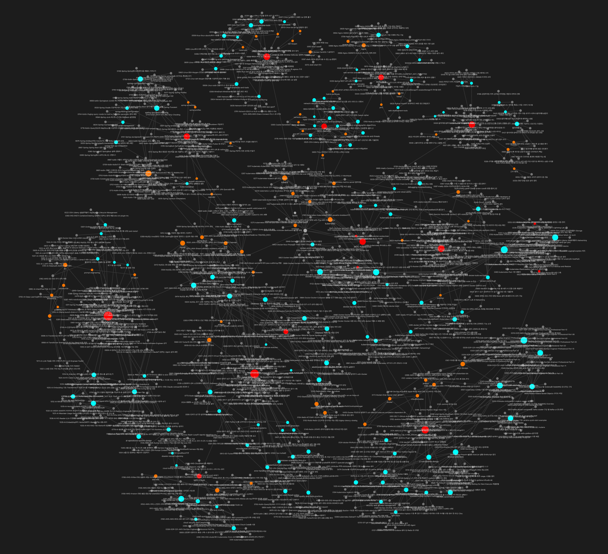

# Blog Wiki Builder

**블로그 글을 Obsidian 지식 위키로 변환하는 LLM 파이프라인**



## 문제

블로그에 1000개 글을 써도 **"내가 뭘 아는지"** 설명할 수 없었습니다.
글은 시간순으로 쌓일 뿐, 지식으로 연결되지 않았습니다.

## 접근

Karpathy의 [LLM Wiki](https://gist.github.com/karpathy/442a6bf555914893e9891c11519de94f) 아이디어를 블로그에 적용했습니다.

> "RAG처럼 매번 원본을 검색하지 말고, LLM이 위키를 만들고 유지보수하게 하라"

```
Raw Sources (987개 포스트)  →  Wiki (개념/기술 페이지)  →  Schema (구조 규칙)
```

블로그 글을 4계층 위키로 재구성합니다:

| 계층 | 역할 | 예시 |
|---|---|---|
| **MOC** | 카테고리 진입점 | MOC-DevOps, MOC-Kubernetes |
| **Concept** | 여러 글에서 합성한 지식 | "CI/CD 파이프라인 설계" |
| **Entity** | 기술/도구 + 사용 경험 | Docker, Jenkins |
| **Post** | 블로그 원본 | 개별 블로그 글 |

## 결과

[Peterica 블로그](https://peterica.tistory.com) (987글)에 적용한 결과:

| 지표 | 값 |
|---|---|
| MOC | 12개 |
| Concept | 122개 |
| Entity | 61개 |
| Rubric PASS | 98.2% (970/987) |
| 위키링크 정합성 | 100% (792/792) |
| 처리 시간 | ~4시간 (로컬 LLM) |

## 배운 것

**1. LLM은 읽기보다 정리(bookkeeping)에서 가치를 발휘한다**

RAG는 매번 원본을 검색합니다. 위키는 한 번 합성하면 지속됩니다.
LLM에게 "읽어줘"가 아니라 "정리해줘"를 시키는 것이 핵심이었습니다.

**2. 좋은 AI 결과는 모델이 아니라 설계된 시스템에서 나온다**

포스트 전문 대신 메타데이터(요약+태그)만 넘겨 **84% 토큰 절감**.
카테고리 오분류 27.2%를 자동 교정하는 검증 단계를 넣었습니다.
qwen3:8b 로컬 모델로도 충분한 결과가 나온 이유는 파이프라인 설계 덕분입니다.

**3. 검증 없는 자동화는 무의미하다**

Rubric 기반 품질 검증과 위키링크 정합성 검사를 자동화했습니다.
PASS rate 98% 미만이면 파이프라인이 멈추게 설계했습니다.

## 당신의 블로그에 적용하기

`config.yaml`을 수정하면 어떤 블로그든 적용할 수 있습니다:

```yaml
blog:
  url: "https://your-blog.tistory.com"    # 블로그 URL
  platform: "tistory"                      # tistory | wordpress | rss

llm:
  provider: "ollama"                       # ollama (무료) | openai | anthropic
  model: "qwen3:8b"

wiki:
  moc_map:
    DevOps: DevOps                         # 카테고리 → MOC 매핑
    Python: Programming
```

```bash
# 설치
git clone https://github.com/peterica/peterica-blog-wiki.git
cd peterica-blog-wiki
python -m venv .venv && source .venv/bin/activate
pip install -r requirements.txt

# Ollama 준비 (무료 로컬 LLM)
ollama pull qwen3:8b && ollama serve

# 실행
bash scripts/run_pipeline.sh
```

Obsidian에서 `wiki/` 폴더를 vault로 열면 그래프 뷰로 지식 네트워크를 볼 수 있습니다.

<details>
<summary><b>파이프라인 상세 구조</b></summary>

```
Step 0: discover.py     URL 수집 (sitemap/archive)
Step 1: shard.py        배치 분할 (50건 단위)
Step 2: scrape.py       HTML 파싱, 본문 추출
Step 3: summarize.py    LLM 요약/태깅/카테고리 분류
     → evaluate.py      Rubric 품질 검증
     → merge.py         shard 병합
Step 4: wiki_categorize → wiki_moc → wiki_generate → wiki_wikilink
Step 5: wiki_crosslink  크로스링크 + _index.md
Step 6: wiki_obsidian   Obsidian 설정
     → wiki_evaluate    위키 품질 평가
```

### 토큰 절약 전략

LLM에 포스트 전문을 넘기면 건당 ~500자. 이미 생성된 요약/태그만 전달하면 건당 ~80자.

```
포스트 전문: 500자 × 8건 = 4,000자
요약+태그:   80자 × 8건 =   640자  → 84% 절감
```

### 디렉토리 구조

```
blog-wiki-builder/
├── config.yaml          # 모든 설정의 단일 소스
├── scripts/             # 파이프라인 스크립트 (14개)
├── wiki/                # Obsidian vault (산출물)
├── data/                # 중간 데이터
├── docs/                # 과정 문서
└── reports/             # 품질 리포트
```

</details>

## 과정 문서

이 파이프라인을 만든 과정과 판단 근거를 정리했습니다:

- [00-architecture.md](docs/00-architecture.md) — 전체 아키텍처
- [01-discover.md](docs/01-discover.md) — URL 수집
- [02-scrape.md](docs/02-scrape.md) — 스크래핑
- [03-summarize.md](docs/03-summarize.md) — LLM 요약, 토큰 절약
- [04-wiki-build.md](docs/04-wiki-build.md) — 위키 빌드 6단계
- [05-quality.md](docs/05-quality.md) — 품질 검증
- [06-obsidian.md](docs/06-obsidian.md) — Obsidian 설정

## 기술 스택

- Python (httpx, selectolax) — 스크래핑/파이프라인
- Ollama + qwen3:8b — 로컬 LLM (무료)
- Obsidian — 지식 위키 시각화
- YAML — config 기반 범용 설정

## 참고

- [Karpathy LLM Wiki](https://gist.github.com/karpathy/442a6bf555914893e9891c11519de94f) — 원본 아이디어
- [OmegaWiki](https://github.com/skyllwt/OmegaWiki) — 연구 논문에 LLM Wiki를 적용한 프로젝트
- [블로그 글: LLM Wiki 적용기](https://peterica.tistory.com/1059) — 이 프로젝트의 상세 과정
